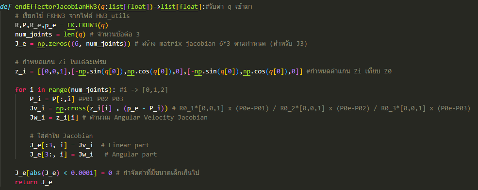

# FRA333_HW3
จัดทำโดย นายคณพล กาจธัญกิจ 65340500005 และ นายอาคม สนธิขันธ์ 65340500077

โปรแกรมนี้เป็นโปรแกรมสำหรับหา Jacobian, Singularity และ Effort ของหุ่นยนต์ RRR ที่มีลักษณะโครงสร้างดังรูปที่ 1 


## ติดตั้งก่อนการใช้งาน

โปรแกรมนี้ต้องการ `numpy` และ `roboticstoolbox` ในการทำงาน คุณสามารถติดตั้งได้โดยใช้คำสั่งต่อไปนี้:

```bash
pip install numpy<2
pip3 install roboticstoolbox-python
```
โปรเจคนี้ประกอบไปด้วย 3 ไฟล์หลักสำหรับการทำงาน:

1. `FRA333_HW3_xx_xx.py` – ไฟล์ที่เก็บฟังก์ชันต่างๆ ที่พัฒนาสำหรับการแก้หา Jacobian, Singularity และ Effort ของหุ่นยนต์
2. `testScript.py` – สคริปต์สำหรับทดสอบฟังก์ชันที่พัฒนาในไฟล์ `FRA333_HW3_xx_xx.py` และเปรียบเทียบผลลัพธ์กับ Robotic Toolbox
3. `HW3_utils.py` เป็นไฟล์สำหรับสมการ Forward Kinematics ที่ใช้ในการหา Jacobian, Singularity และ Effort ของหุ่นยนต์

## Files and Functions

### 1. `FRA333_HW3_xx_xx.py`
ไฟล์นี้ประกอบด้วยฟังก์ชันหลัก 3 ฟังก์ชันที่ใช้ในการแก้โจทย์:

- **`endEffectorJacobianHW3(q: list[float]) -> list[float]`**  
  ฟังก์ชันนี้คำนวณเมทริกซ์ Jacobian สำหรับตำแหน่ง end-effector โดยรับค่ามุมข้อต่อ `q`
  - **Input**:  
    - `q`: รายการมุมข้อต่อ (จำนวน 3 ข้อสำหรับหุ่นยนต์ 3-DOF)


  - **Output**:  
    - เมทริกซ์ Jacobian ขนาด 6x3 ซึ่งแสดงความสัมพันธ์ระหว่างความเร็วเชิงเส้นและเชิงมุม

- **`checkSingularityHW3(q: list[float]) -> bool`**  
  ฟังก์ชันตรวจสอบว่าหุ่นยนต์อยู่ในสภาวะ singularity หรือไม่ โดยการคำนวณค่า determinant ของส่วนเชิงเส้นของเมทริกซ์ Jacobian
  - **Input**:  
    - `q`: รายการมุมข้อต่อ (จำนวน 3 ข้อ)
  - **Output**:  
    - ค่าบูลีน (`True` หากหุ่นยนต์อยู่ในสภาวะ singularity, `False` หากไม่อยู่ในสภาวะดังกล่าว)
  
- **`computeEffortHW3(q: list[float], w: list[float]) -> list[float]`**  
  ฟังก์ชันคำนวณแรงบิดที่ต้องการสำหรับข้อต่อโดยรับมุมข้อต่อ `q` และเวกเตอร์ wrench ภายนอก `w`
  - **Input**:  
    - `q`: รายการมุมข้อต่อ (จำนวน 3 ข้อ)
    - `w`: เวกเตอร์ wrench (ขนาด 6) ที่ประกอบด้วยโมเมนต์และแรง
  - **Output**:  
    - รายการแรงบิดที่จำเป็นสำหรับแต่ละข้อต่อ

### 2. `testScript.py`
สคริปต์นี้ใช้ตรวจสอบความถูกต้องของฟังก์ชันที่พัฒนาในไฟล์ `FRA333_HW3_xx_xx.py` โดยเปรียบเทียบกับผลลัพธ์ที่ได้จาก Robotic Toolbox (`rtb`)

#### Test Descriptions:

- **ทดสอบ Jacobian ของ end-effector**:  
  เมทริกซ์ Jacobian ที่คำนวณโดยใช้ฟังก์ชัน `endEffectorJacobianHW3` จะถูกเปรียบเทียบกับผลลัพธ์จากโมเดลของหุ่นยนต์ใน Robotic Toolbox

- **ทดสอบ singularity**:  
  ฟังก์ชันตรวจสอบ singularity จะถูกทดสอบโดยการตรวจสอบค่า determinant ของส่วนเชิงเส้นของ Jacobian ทั้งจากการคำนวณแบบกำหนดเองและ Robotic Toolbox

- **ทดสอบแรงบิดที่ข้อต่อ**:  
  แรงบิดที่ข้อต่อที่คำนวณได้จากฟังก์ชัน `computeEffortHW3` จะถูกเปรียบเทียบกับค่าแรงบิดที่ได้จาก Robotic Toolbox โดยใช้ wrench เดียวกัน

## วิธีการรันโปรแกรม

1. รันไฟล์ `FRA333_HW3_xx_xx.py` เพื่อเรียกใช้ฟังก์ชันและแสดงผลลัพธ์ของแต่ละปัญหา
2. ใช้ไฟล์ `testScript.py` เพื่อตรวจสอบความถูกต้องของฟังก์ชันเทียบกับผลลัพธ์จาก Robotic Toolbox
